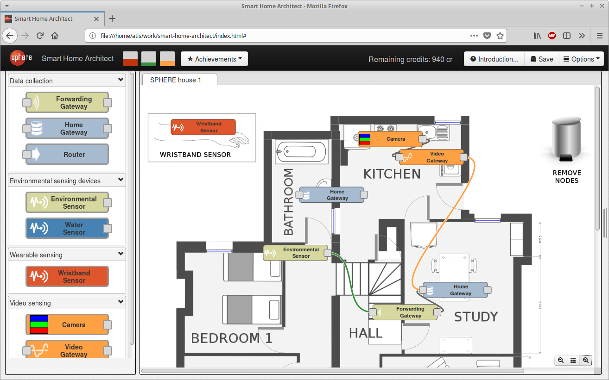

Smart Home Architect
====================

Smart Home Architect is a web-based game that interactively demonstrates SPHERE technology.

It is available for playing at https://irc-sphere.github.io/smart-home-architect/

## Overview ##

You are the **Smart Home Architect**.

Your mission is to design a [system for monitoring health-related behaviors](http://irc-sphere.ac.uk/).

Your goals are to:

* Capture participant activities and location by using wristband sensors and forwarding gateways;
* Capture the ambient temperature, humidity and lighting levels through the house with environmental sensors;
* Capture detailed movement and location information with cameras connected to video processing gateways;
* Store the captured data on a home gateway.

## How to play ##

Use the sensors and other hardware devices; place them in the rooms and connect together to create a meaningful system:

* Click and drag the devices from the palette onto the floor plan.
* Place the devices in appropriate rooms. For example, install sensors in kitchen to gather data about behaviors releated to cooking and eating.
* Connect the devices with communication links.

If you get stuck, look carefully at the suggestions shown by the system. They contain information on what to do next, and how to fix any current problems.

The main goals of the game are to explore the options and to enjoy the process while learning more about smart home systems. However, if you feel ambitious, you could try to achieve:

* **End goal:** fully cover the house with all three sensing modalities (environmental, wristband, and video) and unlock the full list of achievements.

Copyright [University of Bristol](http://www.bristol.ac.uk/), 2018.
